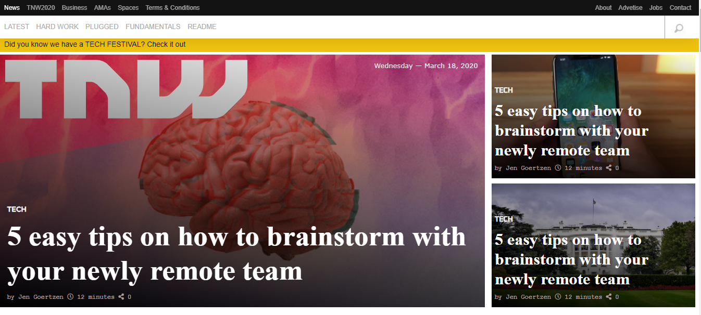

# The Next Web Project
This is a web clone of the Next Web, a tech-focused magazine which uses media queries to gracefully degrade their site as the window size is reduced.

This project shows the format of designing a responsive webpage using HTML semantics element and CSS media queries of different breakpoints, for smaller devices, medium devices and large screen devices. These various breakpoints makes the webpage responsive across various platforms.

## Built With

- html, css
- vscode

## Live Demo

[Live Demo Link](https://rawcdn.githack.com/okikiola11/the-next-web/a33338454c633897f30e4030349be089c904038a/index.html)

## Getting Started

To get a local copy up and running follow these simple example steps.

### Prerequisites
- Web browser
- Code editor
- Git and Github

### Usage
- Clone the project to your local machine 
- Open the index file in your browser

## Authors

- Okikiola Apelehin
- Daniel Duran 

👤 **Author1**

- Github: [okikiola apelehin](https://github.com/okikiola11)
- Twitter: [okikiola apelehin](https://twitter.com/Kikiolla3)
- Linkedin: [okikiola apelehin](https://www.linkedin.com/in/okikiola-apelehin-459008122/)

👤 **Author2**

- Github: [daniel duran](https://github.com/Daniduran-devr)
- Twitter: [@twitterhandle]()
- Linkedin: [linkedin]()

## 🤝 Contributing

Contributions, issues and feature requests are welcome!

Feel free to check the [issues page](issues/).

## Show your support

Give a ⭐️ if you like this project!

## Acknowledgments

- Google

## 📝 License

This project is [MIT](lic.url) licensed.
